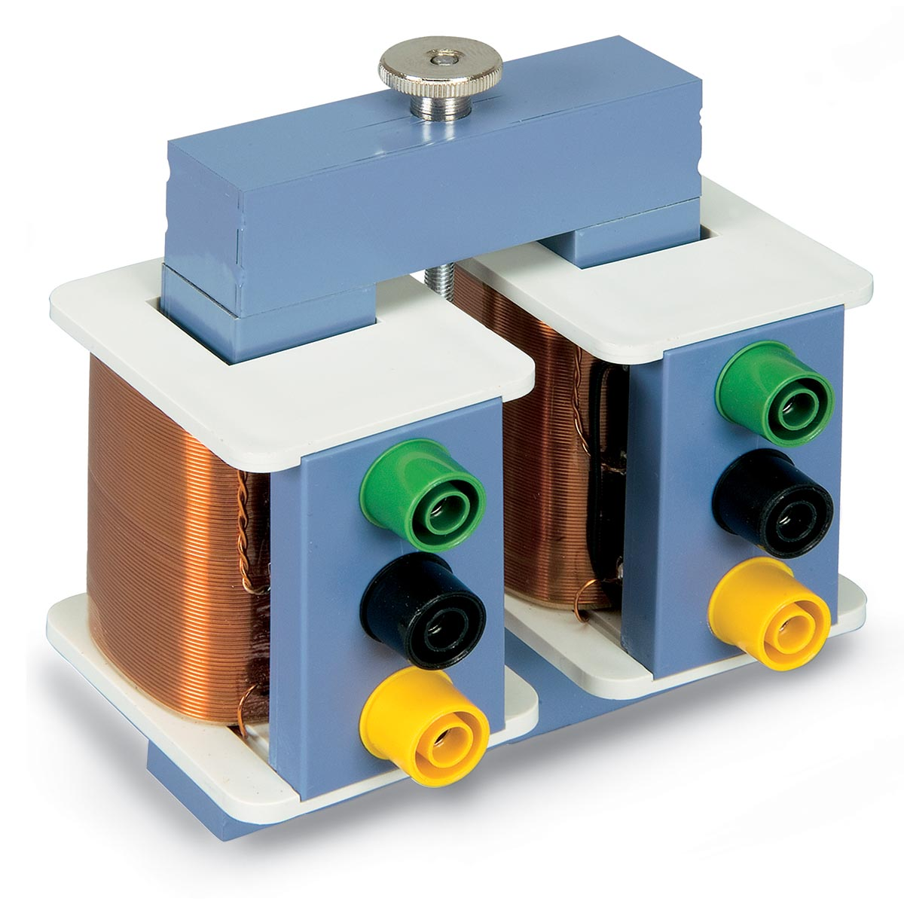
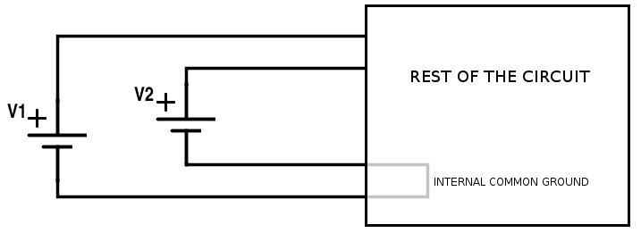
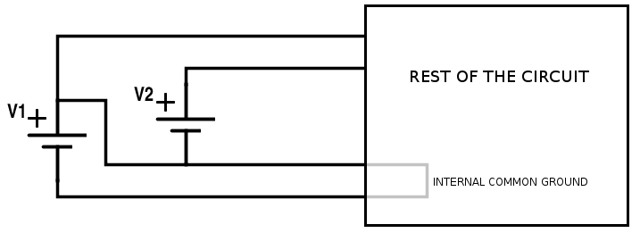

Galvanic isolation is the decoupling of different parts of circuits to prevent everything except power or signals from getting through. For example, a transformer:

A transformer is isolating because there is no electrical connection between the left and right coil - no matter what you do electrically to the left coil, the right coil would only see the energy transferred through the magnetic field in the iron rectangle.

### Why bother?

Galvanic isolation is very common in industrial electronics, where robustness is very important. In hobbyist applications, we can generally get away without any isolation, in return for lower costs and simpler designs. However, there are still several situations where it shouldn't just be an afterthought.

Consider a battery-powered circuit that sends tweets when myoelectric sensors detect that the user is activating muscles. If the circuit is ever plugged into mains power for charging, then a fault in the circuit could potentially expose the user to dangerous electric shocks.

If safety or reliability are concerns for a design, it is necessary to at least give some thought to isolation.

Isolation is also important when we have different, fixed ground potentials for power sources in a circuit. Suppose we want a circuit like below, using two external DC power supplies. Ideally, we want to work with power supplies like this:

However, since we don't control where those DC power supplies are being plugged in to, it's actually possible to get something like the following:

That's a short! Generally, that grey wiring inside the circuit will be the first thing to go up in flames. The issue here is that it's not safe to assume that the two grounds for the power supplies are at the same potential - if we connect them together, we get a [ground loop](https://en.wikipedia.org/wiki/Ground_loop_(electricity)), as shown above. It is not always practical to redesign a circuit to not use a common ground, so in these cases we simply ensure that the power for at least one of the supplies is isolated.

Most hobbyist-grade DC power supplies you'll see are non-isolating. Consider the [UBEC DC converter/power supply](http://www.adafruit.com/products/1385) from Adafruit. If we look at the [datasheet](http://www.adafruit.com/datasheets/MP2307_r1.9.pdf) linked in the product page, we see this:

Notice that the ground for the input is the same as the ground for the output. Therefore, the output is linked to the input in ways other than just energy transfer (the ground potential of the output must always be the ground potential of the input), and so the circuit as a whole is non-isolating.

An easy way to tell if a power supply you already have is isolating is to try testing the resistance between various input and output pins, using a multimeter or other tester. If the measured resistance isn't infinite or huge (over 1 MΩ), then the power supply is definitely not isolating. However, the converse isn't necessarily true; it is possible to have non-isolating power supplies that still have infinite resistances between all inputs and outputs when measured using a multimeter.

### How do I get isolated power?

If you're starting with AC as input, this is simple - simply ensure a transformer is the only thing connecting two halves of the power supply, and it is guaranteed that there is no electrical connection between the inputs and outputs. Since the simplest design for a power adapter uses this configuration, most simple transformer-based power supplies are isolating.

DC is a bit harder - we must convert it to AC first, pass it through a transformer (or an isolating capacitor) for isolation, and finally convert it back to DC for output. In fact, switching regulators essentially already convert DC to AC, and topologies such as flyback and push-pull can in fact be made to be isolating (properly implementing isolated feedback is generally the biggest problem here).

Chips like the [MAX17681](http://www.maximintegrated.com/en/products/power/isolated-power/MAX17681.html), a push-pull transformer driver IC, can make it practical to build your own isolating DC power supply using only a few additional components. A tutorial for building one will be posted soon.

### How do I isolate signals?

Logic is a lot easier to isolate than power supplies, since we only need to get the signal across, not the energy. The standard way to do this is to use an optoisolator, like [these ones](https://www.sparkfun.com/products/9118) from SparkFun. Optoisolators are simply a light and a light sensor, all bundled together. The input gets encoded into light at one end, which sensed by the light sensor at the other end, reproducing the signal without any electrical connections.

When using optoisolators, your circuit will only truly be isolated if your power and ground are isolated as well. As a result, it is important to make sure that you use a separate power supply for the circuits on each side of the optoisolator, or to isolate the power across the boundary (see the "Power supplies" section above).

Another thing to be aware of is that optoisolators have a limited lifespan since the light is an LED, which will age over time. However, in most cases this lifespan is so long that it is not a concern, unless your circuit is going to be in relatively extreme conditions like high temperatures.

Optoisolators are relatively slow, and do not work that well with things like like SPI when operating at higher frequencies. For these situations, we generally just have to slow down the transmission rate so the optoisolator can keep up. Note that optoisolators will not directly work with protocols that are bidirectional, since some information will not be transferred by the optoisolator.
