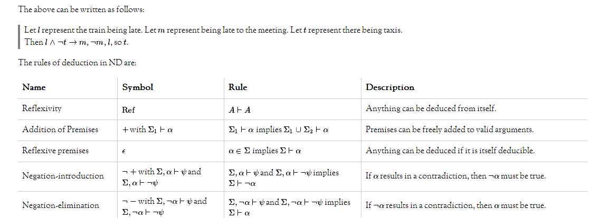

A few people have asked now about the technical setup behind my [lecture notes](../University-Notes). It's actually very simple.

In class, I write notes in [Markdown](https://en.wikipedia.org/wiki/Markdown), a formatting syntax that is incredibly easy and efficient to write. Markdown has a lot of dialects and variations since the original version was described, but I use the one supported by [StackEdit.io](https://github.com/benweet/stackedit#readme), a powerful Markdown application with support for things like LaTeX and UML diagrams built-in. The writing itself is done in a standard text editor, which in my case is either Cream/Vim or a Scintilla-based editor like SciTE or Geany. The result looks something like this:

    **Euler's formula** relates the number of vertices, edges, and faces to each other. Let $G$ be a connected graph with a planar embedding and $F$ be the set of faces in $G$. Then $\abs{V(G)} - \abs{E(G)} + \abs{F(G)} = 2$. In other words, the number of vertices plus the number of faces minus the number of edges always results in 2.

    Proof:

    > Induction over fixed $\abs{V(G)}$ and induction on $\abs{E(G)}$. Let $F(H)$ be the set of faces in a graph $H$.  
    > Clearly, the smallest possible connected graph with a planar embedding is a tree, so it is one such that $\abs{E(G)} = \abs{V(G)} - 1$. Since there is only one face, $\abs{V(G)} - \abs{E(G)} + \abs{F(G)} = \abs{V(G)} - (\abs{V(G)} - 1) + 1 = 2$.  
    > Suppose for some $k$ that for all $\abs{E(G)} < k$, $\abs{V(G)} - \abs{E(G)} + \abs{F(G)} = 2$.  
    > Assume $\abs{E(G)} = k$. Let $e$ be an edge in a cycle, which must exist because graph has more than $\abs{V(G)} - 1$ edges and is not a tree.  
    > Then if we remove $e$ from $G$ to get $G'$, $G'$ is also connected and planar, since $e$ is in a cycle and is therefore not a bridge.  
    > Clearly, $G'$ has $\abs{F(G)} - 1$ faces, since $e$ was in a cycle and had two different faces on both sides, and removing $e$ merges them into one face.  
    > So $\abs{V(G')} - \abs{E(G')} + \abs{F(G')} = 2$. Since $G$ has one more edge and one more face than $G'$, $\abs{V(G)} - \abs{E(G)} + \abs{F(G)} = \abs{V(G')} - (\abs{E(G')} + 1) + (\abs{F(G')} + 1) = 2$.  

Markdown syntax is pretty powerful. With the built-in Markdown contructs, it's possible to represent anything HTML can (since it allows inline HTML), and with the LaTeX extension, it's possible to render math as well.

The only real problem comes from diagrams. Things like electronic circuits and graphs are best represented using free-form vector graphics, but there is no such facility in the language. A solution I've used in the past is to draw out the diagrams using applications such as Inkscape (for general graphics), Webtronics (for electronic circuits), or UMLet (for UML diagrams), and then embed the exported and minified SVG directly into the document as XML. This tends to look something like this:

    <svg xmlns="http://www.w3.org/2000/svg" width="140" height="126"><rect x="0" y="0" fill="white" width="140px" height="126px"/><text x="56" y="113" font-size="12" fill="black" stroke-width="0px">V_{cc}-</text><text x="52" y="17" font-size="12" fill="black" stroke-width="0px">V_{cc}+</text><text x="10" y="80" font-size="12" fill="black" stroke-width="0px">V_p</text><text x="10" y="44" font-size="12" fill="black" stroke-width="0px">V_n</text><text x="107" y="65" font-size="12" fill="black" stroke-width="0px">V_O</text><g id="u" stroke="#000" stroke-width="2px" class="op-amp" transform="matrix(1,1.2246468525851679e-16,1.2246468525851679e-16,-1,40,90)"><metadata class="part"><wtx:part xmlns:wtx="http://code.google.com/p/webtronics"><wtx:pins><wtx:analog><!-- all opamp models must be in this order * CONNECTIONS: NON-INVERTING INPUT * | INVERTING INPUT * | | POSITIVE POWER SUPPLY * | | | NEGATIVE POWER SUPPLY * | | | | OPEN COLLECTOR OUTPUT * | | | | | .SUBCKT LM339 1 2 3 4 5 --><wtx:node index="1" x="0" y="10"/><wtx:node index="2" x="0" y="50"/><wtx:node index="3" x="30" y="0"/><wtx:node index="4" x="30" y="60"/><wtx:node index="5" x="60" y="30"/></wtx:analog></wtx:pins><wtx:id>u</wtx:id><wtx:type>u</wtx:type><wtx:name>op-amp</wtx:name><wtx:category>amplifier</wtx:category><wtx:value/><wtx:spice/><wtx:label/><wtx:flip>true</wtx:flip><wtx:model/></wtx:part></metadata><path id="path1887" fill="none" d="M50,30,10,60,10,0,50,30z"/><path id="path1889" d="M0,10,10,10"/><path id="path1893" d="M0,50,10,50"/><text id="text1895" y="20" x="15" font-size="12px" stroke-width="0px">+</text><path id="path2167" d="M50,30,60,30"/><text id="text1915" y="45" x="15" font-size="12px" stroke-width="0px">_</text><path id="path2" d="M30,0,30,15"/><path id="path2" d="M30,45,30,60"/></g></svg>

That's the part that happens during class. Afterwards, everything is more or less automated. The text is converted into HTML via [Pandoc](http://johnmacfarlane.net/pandoc/), a utility capable of converting between a ton of different markup formats, including Markdown with embedded LaTeX. Then, the resulting HTML is filled out via a template that brings in [MathJax](http://www.mathjax.org/) (for rendering the LaTeX math), code styles, and other general presentation-related stuff.

Of course, all of this is done via build script, and then committed to the [GitHub repository](https://github.com/Uberi/University-Notes) by hand due to the need for manual review. Since the repository is set up with GitHub Pages, it's automatically hosted on my website:

