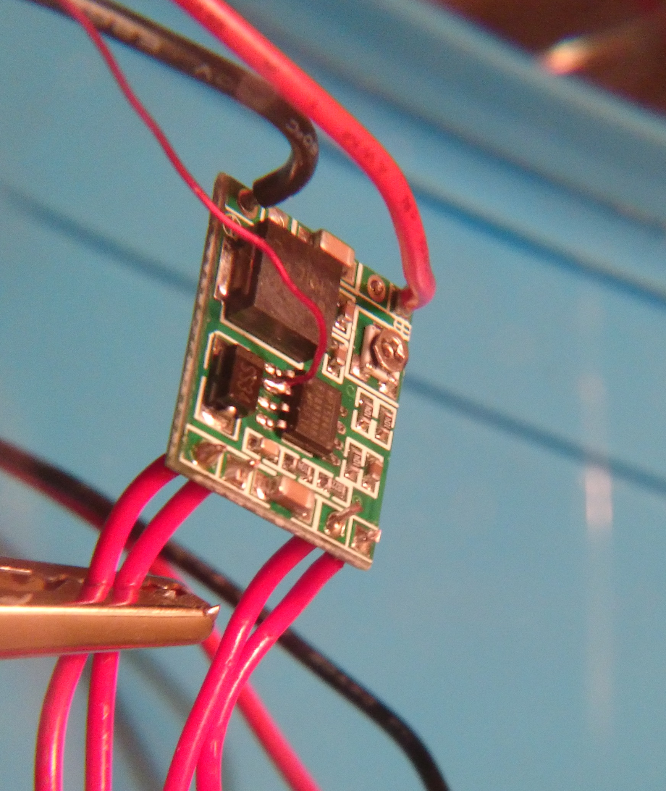
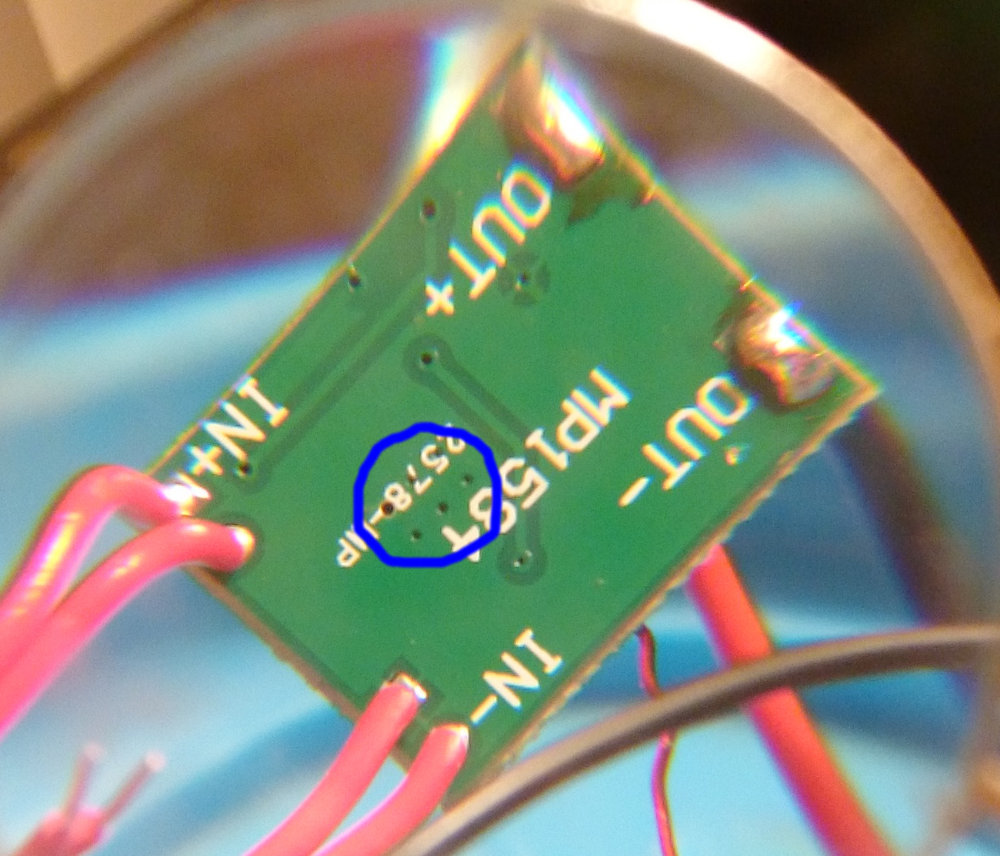
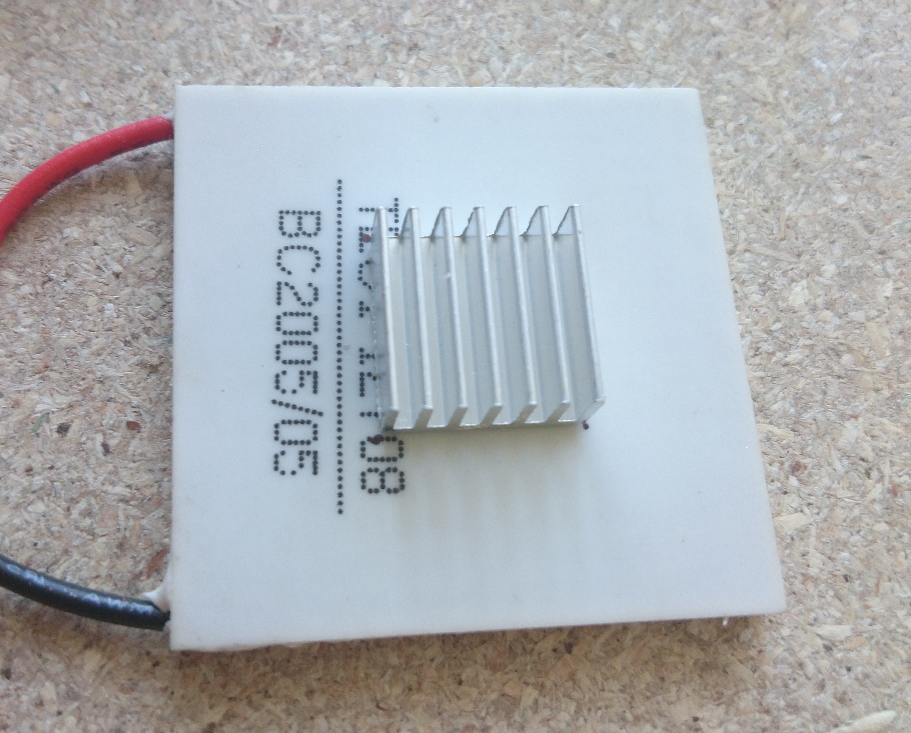
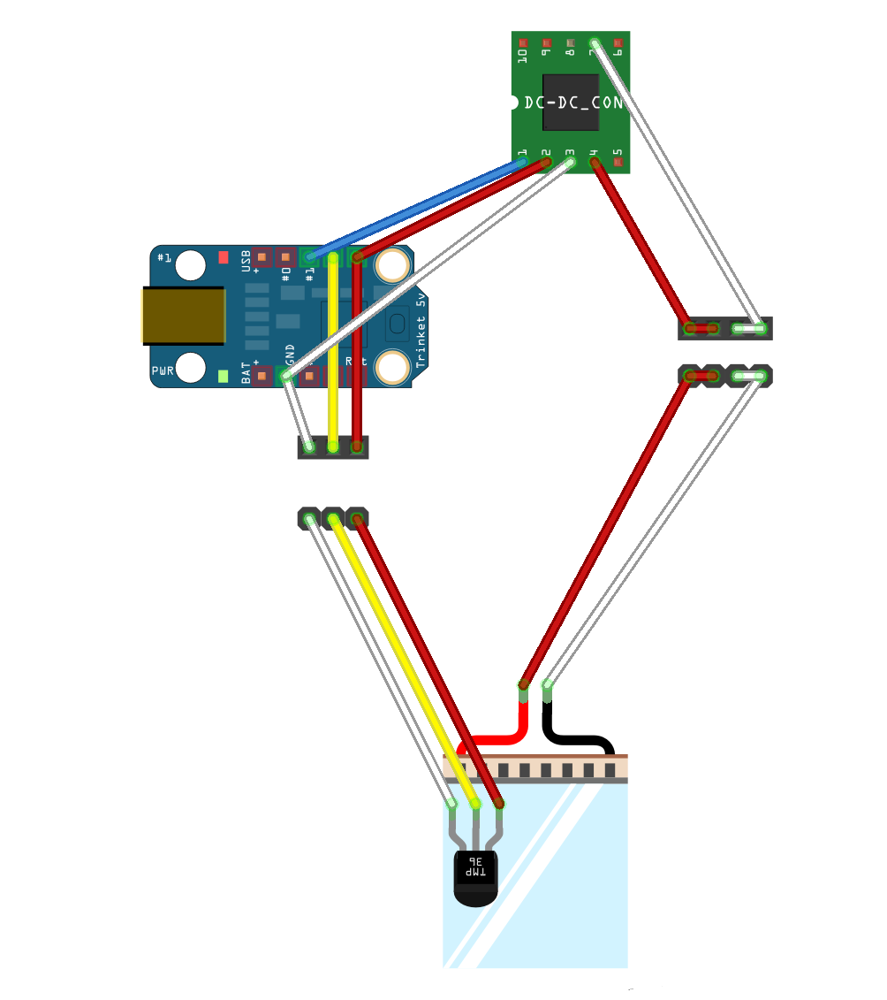
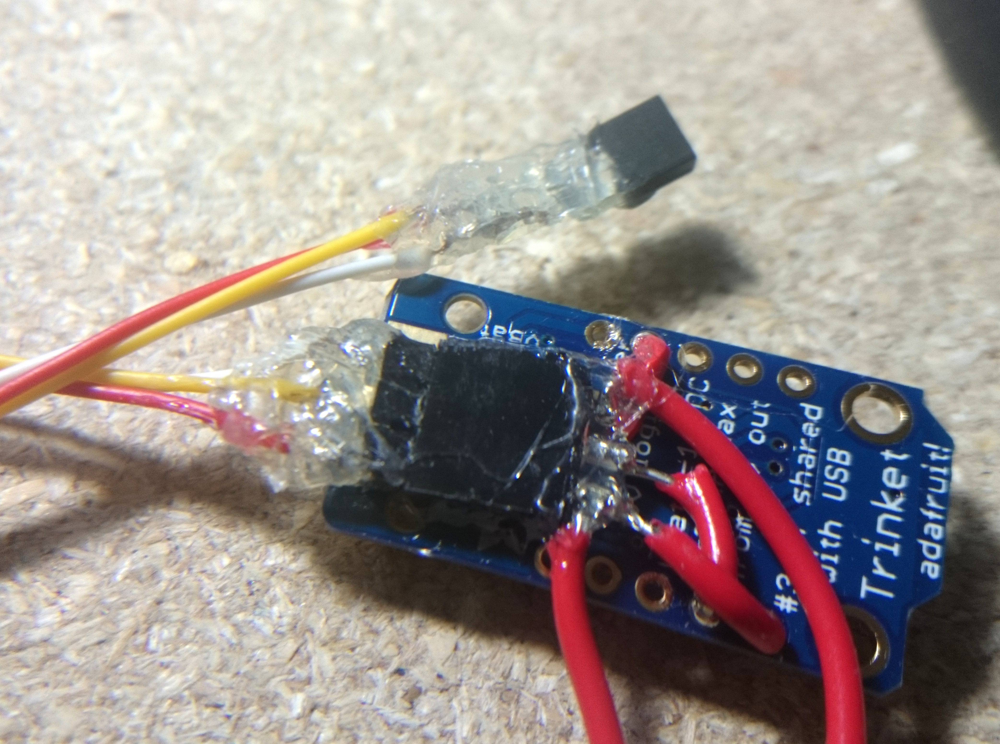
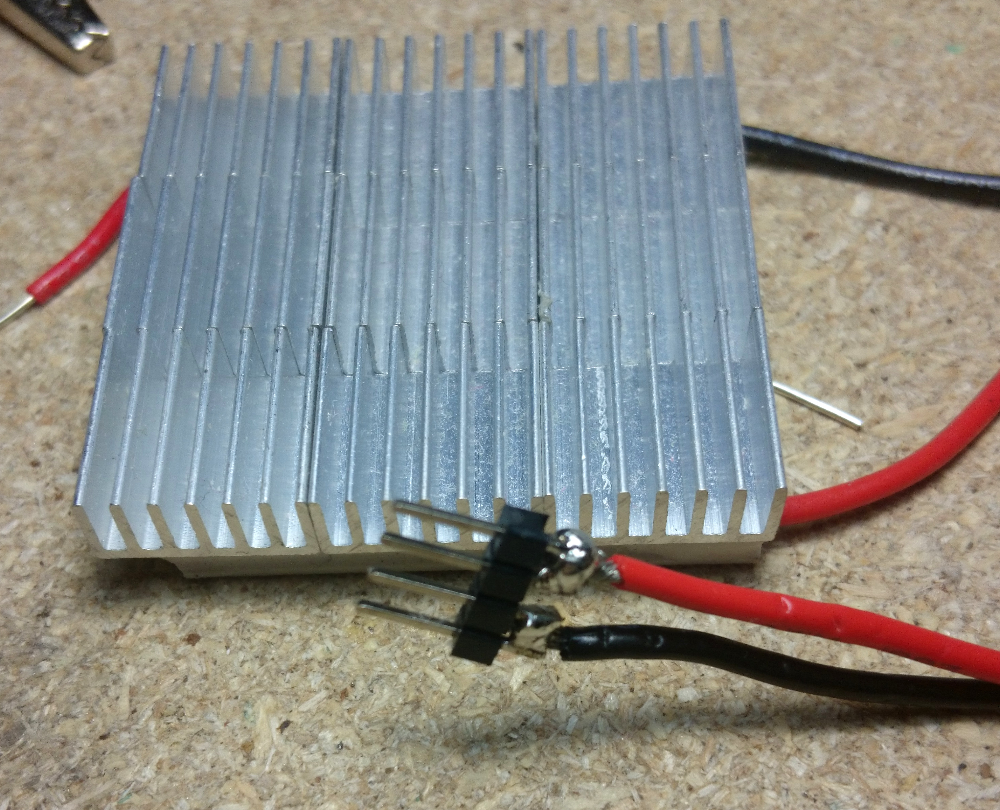
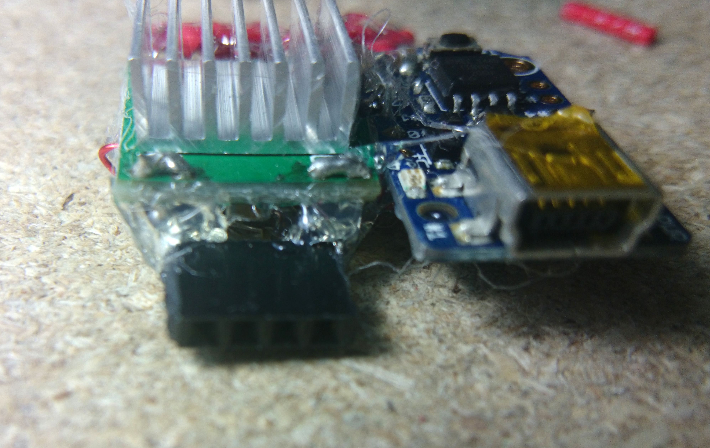
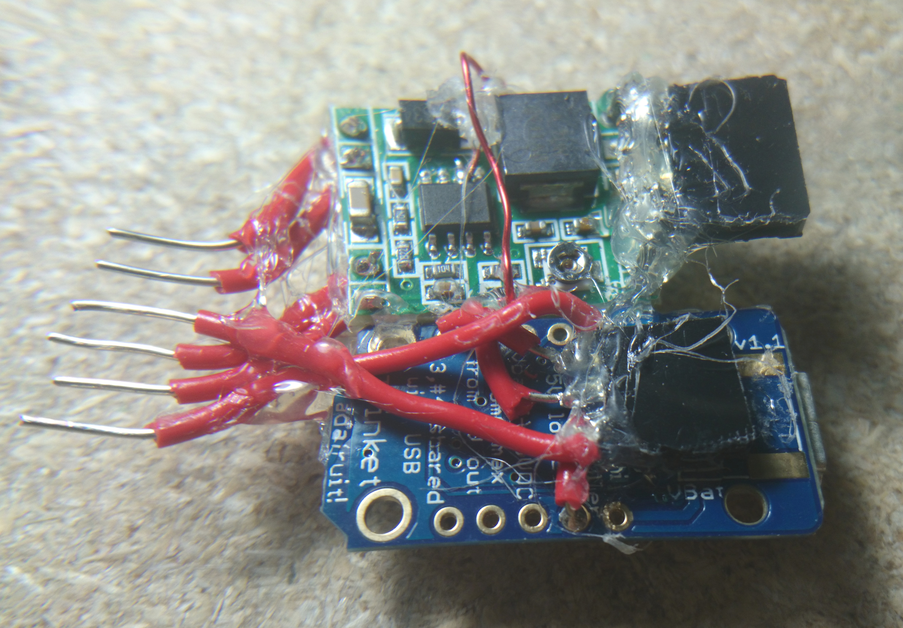
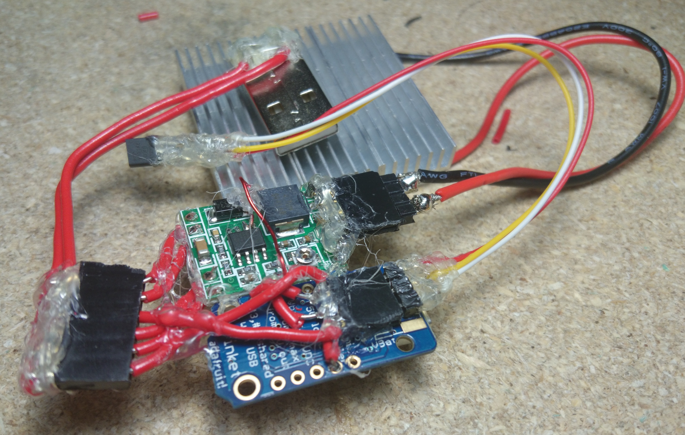
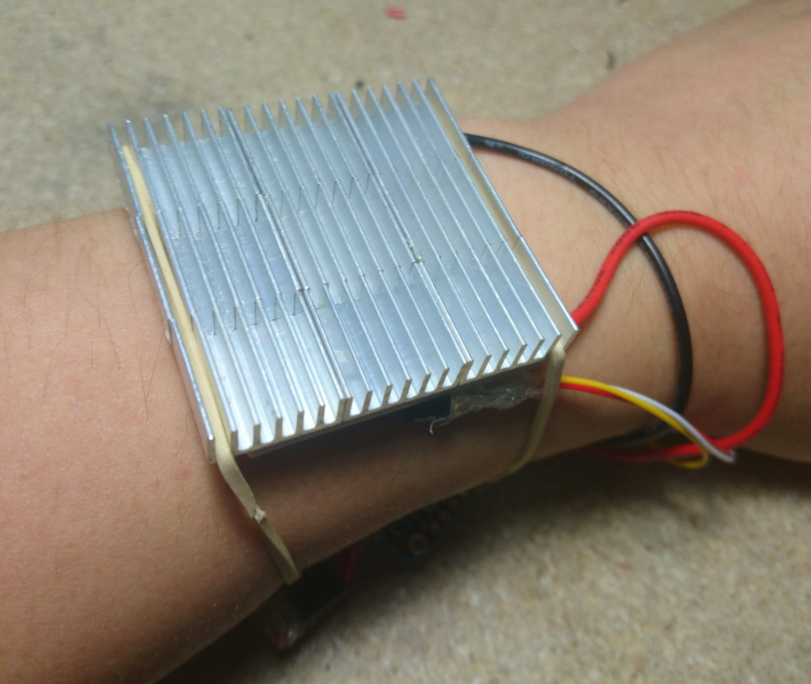

About a month ago, I managed to shatter my right ankle and shin. Thanks to modern medicine, those bones are now reinforced with slender lengths of titanium.

Besides the sudden limb shortage, though, the biggest issue has been the summer heat: intensive activities make the inside of the cast unbearably hot. Can we do better than an ice pack?

### Introduction

Different textbooks about heat often use confusing or conflicting terms for common concepts. In that tradition, here are the confusing and conflicting terms we'll be using:

* **Heat** is the thermal energy transferred across a boundary, measured in Joules ($$\mathrm{J}$$).
    * If there's 1 Joule of heat transferred across a boundary, then the side it was transferred from now has 1 less Joule of thermal energy, and the other side has 1 more.
* The **heat transfer rate** at a given boundary is the derivative of heat with respect to time, measured in Watts ($$\mathrm{W}$$).
    * If the heat transfer rate is $$8 \mathrm{W}$$, then 8 Joules are transferred across the boundary every second.
* The **thermal conductivity** of a given material is the tendency for that material to allow heat transfer, measured in $$\mathrm{W} \mathrm{m}^{-1} \mathrm{K}^{-1}$$ (Watts per meter per Kelvin).
    * Suppose we have a sheet of the given material. Then $$\text{thermal conductivity} = \frac{\text{thickness of the sheet}}{\text{area of one side of the sheet}} \times \frac{\text{heat transfer rate through the sheet}}{\text{temperature difference between both sides of the sheet}}$$.
    * If the thermal conductivity of a material is $$0.5 \mathrm{W} \mathrm{m}^{-1} \mathrm{K}^{-1}$$, then a $$0.1 m$$ thick, $$2 m \times 3 m$$ sheet of that material, where one side has a temperature $$1 \mathrm{K}$$ higher than the other, transfers heat from the warm side to the cool side at a rate of $$0.5 \mathrm{W} \mathrm{m}^{-1} \mathrm{K}^{-1} \times \frac{2 \mathrm{m} \times 3 \mathrm{m}}{0.1 \mathrm{m}} = 30 \mathrm{W}$$.
* The **thermal conductance** of a given sheet of a given material is the tendency for the sheet to allow heat transfer, measured in $$\mathrm{W} \mathrm{K}^{-1}$$ (Watts per Kelvin).
    * We usually write this in terms of thermal conductance: $$\text{thermal conductance} = \text{thermal conductivity} \times \frac{\text{area of one side of the sheet}}{\text{thickness of the sheet}}$$.
    * It can also be expressed in simpler terms: $$\text{thermal conductance} = \frac{\text{heat transfer rate through the sheet}}{\text{temperature difference between both sides of the sheet}}$$.
    * Essentially, this is the ratio of heat transfer rate through the sheet to the temperature difference across the sheet.
* **Thermal resistivity** and **thermal resistance** are the reciprocals of thermal conductivity and thermal conductance, respectively. As a result, they're measured in $$\mathrm{m} \mathrm{K} \mathrm{W}^{-1}$$ and $$\mathrm{K} \mathrm{W}^{-1}$$, respectively.
    * Although thermal resistivity/resistance are a bit less intuitive to define, they have a neat property: when you have a plate with thermal resistance $$R_1$$, and stack it on top of a plate (with the same face dimensions) with thermal resistance $$R_2$$, the combined thermal resistance of the stack of plates is $$R_1 + R_2$$ - thermal resistances stack up!

Generally, something that's 10 degrees above ambient temperature will dissipate energy at twice the rate of something that's 5 degrees above ambient. A cooling unit takes advantage of this by taking thermal energy from one area and gathering all of it up in one place, so it's able to dissipate into the environment.

If we rearrange the thermal conductance equation, we get $$\text{heat transfer rate} = \text{thermal conductivity} \times \text{surface area} \times \text{temperature difference} \times \text{thickness}^{-1}$$. So to maximize the heat transfer rate:

* Use a material that has a high thermal conductivity for paths between the cold side and the ambient sink.
* Have a large surface area with the thing being cooled, and with the environment.
* Make any sheets of materials on the thermal path as thin as possible.

Nowadays, it averages about 32 degrees Celsius outside. Normal human body temperatures [hover around 37 degrees Celsius](a377492.pdf), radiating about 45 Watts per square meter of skin, though this can go over 300 Watts per square meter when performing intensive activities. After a few experiments heating bags of water with known temperature and volume with body heat, I've empirically determined that a small cooling pad can sink up to 5 Watts - more than enough to have a noticeable effect.

### Materials and setup

* A [thermoelectric Peltier cooler](https://www.creatroninc.com/product/thermoelectric-cooler-40x40mm/) ([datasheet](datasheet-601-008.pdf)) for moving thermal energy.
    * These make use of the [Peltier effect](https://en.wikipedia.org/wiki/Thermoelectric_effect#Peltier_effect): at a boundary where two different conductors touch, if current is flowing through that boundary, thermal energy is moved through it as well.
    * This one is a thin ceramic tile with 127 of these junctions embedded inside. Apply current to the red and black wires, and one side will get hot, and the other cold.
* An [analog temperature sensor](https://www.creatroninc.com/product/mcp9701a-temperature-sensor/) ([datasheet](MCP9701A Datasheet.pdf)) for closed-loop control.
    * This one outputs an analog voltage that changes by $$0.0195 V / K$$ (Volts per Kelvin). The temperature has an offset, which means we'd need to calibrate it at a known temperature to get absolute measurements.
* Some [heat sink compound](https://www.creatroninc.com/product/heat-sink-compound-25g/) for attaching... heat sinks.
    * This one apparently has a thermal conductivity of $$0.65 W m^{-1} K^{-1}$$. High-end compounds can get conductivities of up to $$8.9 W / m \cdot K$$!
* Ten of these [14 by 14 by 6 mm heat sinks](https://www.creatroninc.com/product/small-heatsink-14x14x6mm/) for dissipating thermal energy.
  * All of the larger heat sinks available were too tall for this application. Using several smaller, low-profile heat sinks makes the whole thing compact enough to wear.
  * These didn't come with a datasheet, but here's [one for a really similar product](0900766b80d9477a.pdf).
  * Nine of these are for the Peltier cooler, while the tenth is for the DC regulator.
  * These come with thermal tape on the back side, so thermal compound technically isn't needed here. I use the paste anyways to fill any remaining gaps.
* A [DC step-down switching regulator](https://www.creatroninc.com/product/05-20v-2a-adjustable-step-down-regulator/) for supplying power to the Peltier cooler.
  * This one is based off of the MP1584 chip ([datasheet](MP1584_r1.0.pdf)), and a quick inspection of the PCB reveals a circuit quite similar to the "TYPICAL APPLICATION" diagram in the datasheet.
* An [Adafruit Trinket 5V](https://www.adafruit.com/product/1501) ([datasheet](introducing-trinket.pdf)) for control.
    * Although a fully featured microcontroller is overkill for such a simple application, it turned out to be useful for implement more sophisticated control schemes.
    * The Trinket is based on the ATTiny85, and is mostly Arduino-compatible. It can even be programmed using the Arduino IDE!

### Preparation and setup

First, a quick test with the Peltier cooler to see how it works. It turns out that when red is power and black is ground, the side with text on it becomes hot and the other side becomes cold.

I originally meant to use a separate power transistor to turn the cooler on and off. Turns out it's not necessary: according to the MP1584 datasheet, pin 2 is an Enable input, which allows us to turn the DC regulator on and off without the power transistor. Since this pin isn't broken out, I soldered some enamel wire directly to it:

As mentioned earlier, our DC regulator will need a heat sink to handle the load. Where does the heat sink go? Well, if you look closely at the bottom side of the board, you can see 6 tiny holes, which happen to be directly below the MP1584 chip.

Going off page 14 of the MP1584 datasheet, I'd guess that those are thermal vias - solder-filled holes that conduct heat from the chip into the ground plane. We'll clean the board surface with 90% isopropyl, and then place the heat sink directly on top of them.

Same thing goes for the Peltier cooler. After cleaning the side that gets hot, we can just plant the remaining heat sinks in a grid pattern. The first one looks like this:

### Assembly and wiring

[Fritzing](http://fritzing.org/) schematics are really useful for showing how things fit together at a glance. Here's one for this project:

First, we'll connect the female header to the Trinket as shown on the schematic. It's glued to the bottom of the board to keep things organized:

It's hard to hold steady when you're leaning on one leg, but the connections are solid enough. Next, we attach the temperature sensor to a male header, so it can plug into the Trinket:

From top to bottom, the header pins are ground (white wire), temperature sensor reading (yellow wire), and 5V (red wire). The hot glue is a great way to keep the leads insulated, as long as the temperature doesn't get high enough to melt it off while in use. Hopefully it doesn't, or else my leg is going to be pretty unhappy.

Now the same thing, but for the leads on the Peltier cooler. Due to the current requirements, we use two pins in parallel for each wire (each pin is rated for about 3A):

We can now attach the Trinket to the DC regulator (with hot glue, of course!), and connect the enamel wire jumper on the regulator to pin 1 on the Trinket. A 4-pin female header on the DC regulator output gives us a place to plug in the Peltier cooler:

An old USB-A to USB-micro-A cable can be cannibalized for the USB-A plug. We'll connect the 5V and GND pins to 3 pins each on a 6-pin female header:

The leftmost 3 pins on the header are all 5V, while the other 3 are ground. The power leads for the DC regulator and the Trinket are now ready to be connected!

At this point, the cooler is more or less complete:

Here's the entire thing, with the power, Peltier cooler, and temperature sensor connected:

### Programming the controller

For testing purposes, I whipped up a quick simple on/off sketch and loaded it onto the Trinket - turn the cooler on if the temperature is too high, turn it off otherwise:


// digital pin that determines whether the cooler is on
#define COOLER_ENABLE_PIN 1
// analog pin to read the temperature from (in increments of 0.0195 V/K) - note that analog pin 1 is actually pin 2
#define TEMPERATURE_PIN 1

// temperature reading in hundreds of microVolts at 25 degrees Celsius, used for calculating absolute temperature (the temperature sensor isn't factory calibrated)
#define TEMPERATURE_REFERENCE_25 9560
// change in temperature reading in hundreds of microVolts given a 1 degree Celsius change in temperature
#define TEMPERATURE_SLOPE 195
// temperature in Celsius when reading 0 Volts
#define TEMPERATURE_MIN (25 - (TEMPERATURE_REFERENCE_25 / TEMPERATURE_SLOPE))
// temperature in Celsius when reading 5 Volts
#define TEMPERATURE_MAX (25 + ((50000 - TEMPERATURE_REFERENCE_25) / TEMPERATURE_SLOPE))

int target_temperature = 37; // target temperature in Celsius

void setup() {
  pinMode(COOLER_ENABLE_PIN, OUTPUT);
}

void loop() {
    int current_temperature = map(analogRead(TEMPERATURE_PIN), 0, 1023, TEMPERATURE_MIN, TEMPERATURE_MAX); // current temperature in Celsius
    digitalWrite(COOLER_ENABLE_PIN, current_temperature > target_temperature ? HIGH : LOW); // turn on the cooler if and only if the temperature is too high
    delay(1000); // only do this once a second, since we don't want to interfere with the DC regulator internal PWM
}


After programming, the cooler is ready to use - just insert the USB-A plug into a portable power bank and wait a second for it to initialize.

The cooling power is adjustable by changing the potentiometer on the DC step-down switching regulator (the screw on the non-heat-sinked side of the board) to change the board's output voltage. This setting affects only how quickly the cooler will try to reach the target temperature. Higher voltages mean faster, but less efficient cooling, while lower voltages mean slower, more efficient cooling. This is because Peltier coolers work best when there is a large difference between the target temperature difference and the actual temperature difference.

### Results

The first test took place on top of a wrist, with the temperature sensor just beside the Peltier cooler:

The green LED on the Trinket means that the device is on, and the red LED means that the cooler is active. The rubber bands weren't that great at holding the assembly in place, so I switched to clear tape. In the future, it might be worth adding pins to accept a standard watch strap.

After a full day of use, it stopped working, probably due to being soaked in sweat. A quick rinse in deionized water fixed that. Covering all those parts in hot glue would probably make it waterproof (while also making it a lot more difficult to maintain), but it's not a big deal for now.

When in use, the cooler manages to keep the temperature at a fixed, comfortable level. It's definitely a big step up from an ice pack!

### Downloads

* [Adafruit Trinket sketch](peltier-controller.ino)
* [Fritzing schematic](peltier-schematic.fzz)
* [Peltier thermoelectric cooler datasheet](datasheet-601-008.pdf)
* [MCP9701A analog temperature sensor datasheet](MCP9701A Datasheet.pdf)
* [MP1584 switching regulator driver IC datasheet](MP1584_r1.0.pdf)
* [Adafruit Trinket datasheet](introducing-trinket.pdf)