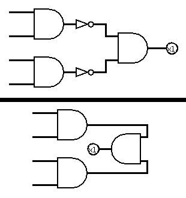
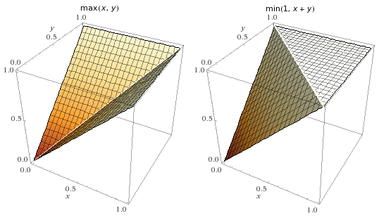
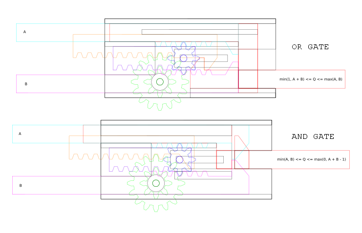
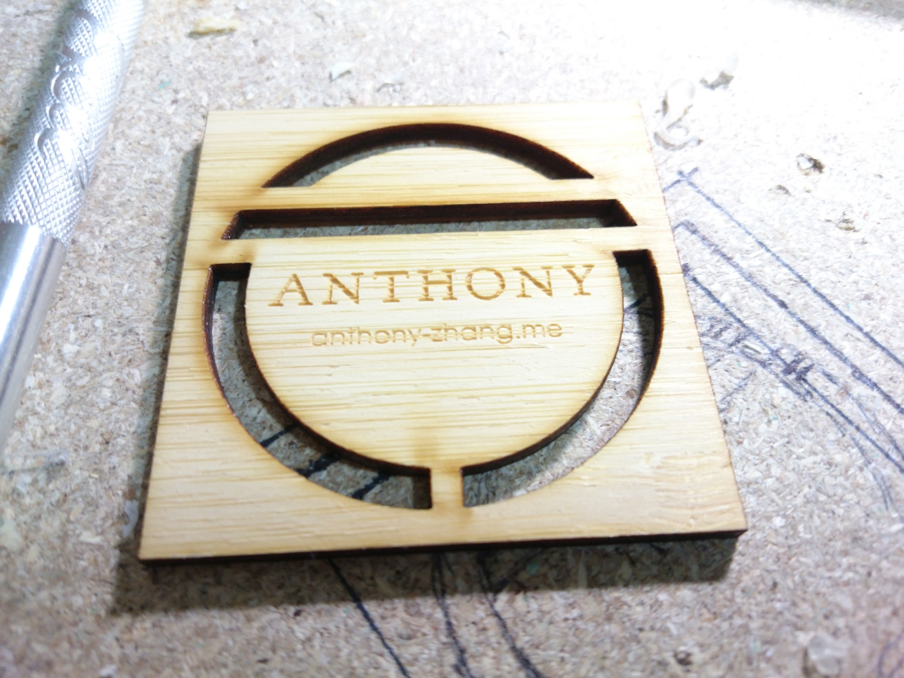

There's just something beautiful about the sight of gears and linkages in motion. Let's build some logic gates!

### Background

There are currently a few well-known systems of mechanical computation:

* The [Analytical Engine](an-engine.pdf).
    * Turing complete instruction set.
    * Uses wheels, cams, and gears to perform operations.
    * Relies on all devices staying in place when not being driven - the device won't work while it's being shaken or moved.
    * Successor to the [Difference Engine](http://satyam.com.ar/Babbage/en/).
* The [Zuse Z1](1406.1886.pdf).
    * Reads program sequentially from punched tape - not Turing complete.
    * Clocked rod logic: all logic is divided into quandrants, and quadrants are stepped one at a time.
    * Each logic gate took at least a quarter of a clock cycle to complete and rotated its signal by 90-degree increments.
    * Based on the "mechanical transistor" - a mechanism that could either transfer or not transfer a signal from one rod to another based on a third "switching" rod.

The Zuse Z1 is especially interesting because it was actually built - Konrad Zuse finished the original in 1938, predating the ENIAC by 8 years. The mechanisms within the device implemented Boolean logic, memory, and even floating point operations, using rods, bars, and levers.

Rod logic is a well-researched topic - here's a basic [rundown of common logic gates](http://www.halfbakedmaker.org/blog/58) implemented using just rods and knobs.

However, all of these mechanical logic systems have a problem - their **gates are not composable**. Consider the identity gate from the link above:

The vertical green rod is the input - it can either be retracted up (logical 0) or extended down (logical 1). The horizontal rod is the output - it can either be retracted left (logical 0), or extendable right (logical 1).

When the input rod is extended, the output rod is **extendable** rather than **extended** - we must attempt to push it in order to obtain its value. That means that in order to feed the output of this gate into the input of another, we need a device to reset the output rod and attempt to push it every time the input rod changes.

The Zuse Z1's rod logic has the same issue. Konrad Zuse solved this with a clever clocked gate design described in the paper linked above - the mechanisms for composing gates took up the entire lower part of the computer. Unfortunately, this also meant that all the gates had propagation delays of at least a quarter of a clock cycle.

### Design

We're going to avoid this issue by designing gates that are directly composable - the output rod will be extended to represent 1, and retracted to represent 0.

#### NOT Gates

This one is pretty simple:

<video src="img/not-gate-mechanism.ogv" controls loop></video>

When the cyan input rod is pushed, it turns the blue gear, which then retracts the red output rod. It is easy to analyze this system and see that the output rod's extension is exactly \\(E - x\\) where \\(E\\) is the maximum extension and \\(x\\) is the input rod extension.

Note that NOT gates will often not be necessary, because retracting a rod from one point of view is extending it from the opposite side - the following two circuits are equivalent, since rotating the AND gate by 180 degrees inverts all of its inputs:

#### OR Gates

This is a bit more complex than the NOT gate, having 3 mechanical layers:

<video src="img/or-gate-mechanism.ogv" controls loop></video>

Here, either of the two cyan and magenta input rods can be extended right to push on the red output rod and cause it to extend right, so the output rod's extension is at least \\(\\max(x\_1, x\_2)\\) where \\(x\_1\\) and \\(x\_2\\) are the amounts by which the input rods are extended.

Additionally, the unanchored small blue gear moves the purple rack gear right by \\(\\frac{x\_1 + x\_2}{2}\\), which, through the green gears, moves the longer orange rack gear by \\(x\_1 + x\_2\\). The orange rack gear hooks onto the red output rod to ensure that the output rod's extension is at most \\(\\min(E, x\_1 + x\_2)\\), where \\(E\\) is the maximum extension and \\(x\_1, x\_2\\) are the extensions of the input rods.

Therefore, the extension of the output rod is between \\(\\max(x\_1, x\_2)\\) and \\(\\min(E, x\_1 + x\_2)\\) inclusive:

From the plots, we can tell that the position of the OR gate's output rod is exactly \\(\\max(x\_1, x\_2)\\) whenever either \\(x\_1\\) or \\(x\_2\\) are either \\(0\\) or \\(E\\).

#### AND Gates

This is very similar to the OR gate:

<video src="img/and-gate-mechanism.ogv" controls loop></video>

Here, either of the two cyan and magenta input rods can be retracted left to pull on the red output rod and cause it to retract left, so the output rod's extension is at most \\(\\min(x\_1, x\_2)\\) where \\(x\_1\\) and \\(x\_2\\) are the amounts by which the input rods are extended.

Additionally, the unanchored small blue gear moves the purple rack gear right by \\(\\frac{x\_1 + x\_2}{2}\\), which, through the green gears, moves the longer orange rack gear by \\(x\_1 + x\_2\\). The orange rack gear pushes the red output rod to ensure that the output rod's extension is at least \\(\\max(0, x\_1 + x\_2 - E)\\), where \\(E\\) is the maximum extension and \\(x\_1, x\_2\\) are the extensions of the input rods.

Therefore, the extension of the output rod is between \\(\\min(x\_1, x\_2)\\) and \\(\\min(0, x\_1 + x\_2 - E)\\) inclusive:

From the plots, we can tell that the position of the AND gate's output rod is exactly \\(\\min(x\_1, x\_2)\\) whenever either \\(x\_1\\) or \\(x\_2\\) are either \\(0\\) or \\(E\\).

#### Alternative designs

There are actually simpler ways to do mechanical AND and OR gates. One of them has a free spur gear like the above designs, but connects that gear to a sliding channel that moves the output rod perpendicular to the input rods (the shape of the channel determines whether it is an AND or an OR gate). In fact, this would even allow us to create an XOR gate with minimal effort. However, the presented designs have several advantages:

* They have **large tolerances** (this is important for being able to reliably build these).
* They have **no backlash**: gear backlash is compensated for by two separate mechanisms (this is important for long signal paths).
* They **transfer force well** (this is important when making long chains of gates).
* They **look cool** (this is always important).

### Construction

The schematics were made directly in Inkscape. In hindsight, it would've been better to simply stick with CAD software, even if Inkscape did make the laser cutting process easier later on.

These designs are the same as in the visualizations above, but with support structures that hold all the parts in place.

I ordered my designs from [Ponoko](https://www.ponoko.com/), a self-serve laser cutting service. The material is ordinary [3mm clear acrylic](http://www.ponoko.com/make-and-sell/show-material/72-acrylic-clear), to allow the internal mechanisms to be visible from outside.

Here's what the cutting design looked like:

A few weeks later, we've got a beautifully cut sheet of acrylic, and the parts come out perfectly:

I'm going to skip the assembly steps, but here are a few notes on the process:

* Hot glue is great because you can undo mistakes, and it's very convenient to work with. However, it sometimes isn't strong enough. Below, you'll notice that some gears are glued together with quick-setting epoxy, due to the the larger amounts of torque on those parts.
* Some edges need to be chamfered to prevent binding or catching, especially edges that are in contact with gears. Ideally, the gears would have spacers so they wouldn't touch the sides at all, but this is a good alternative.
* The axles for the freely sliding gears are coathanger wire, tipped with blobs of hot glue.
* Some parts were moved around a bit to compensate for backlash. For example, the pusher on the AND gate (orange piece in the animation above) has an extra piece glued on to make it push farther than it would otherwise.
* If it doesn't work, put more hot glue on it. This also happens to be good life advice.

### Results

<video src="img/or-gate-final.ogv" controls loop></video>
<video src="img/and-gate-final.ogv" controls loop></video>

Both gates currently have an actuation force of less than 300 mN in all states. This can be reduced further by sanding down the parts that are binding and cleaning up all the extra hot glue.

Off topic, but my laser cut business cards also arrived while writing this. I'm really happy with how they turned out:

### Downloads

* [Gate mechanism animations - Blender3D Blend](mechanisms.blend)
* [NOT gate schematic - Inkscape SVG](not-gate.svg)
* [AND gate schematic - Inkscape SVG](and-gate.svg)
* [OR gate schematic - Inkscape SVG](or-gate.svg)
* [Laser cutting profiles for parts - Inkscape SVG](ponoko-parts.svg)