Let's build a slingshot!

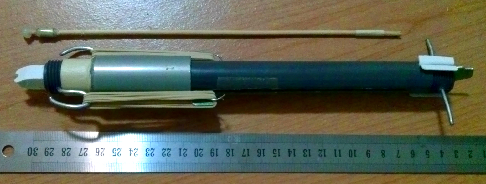

This post contains step-by-step build logs, plus a [Blender3D](http://www.blender.org/) model (to scale) at the end in case any of the information is unclear.

### Mechanism

Slide the grey pipe down toward the other end until the green plate catches on the trigger - this stretches the rubber bands and locks them in the stretched position.

Return grey pipe to original position. Move trigger upwards - this releases the lock and allows the rubber bands to fire the projectile.

See below for a 3D model containing an animation of the mechanism in action. Here it is, rendered from one viewpoint:

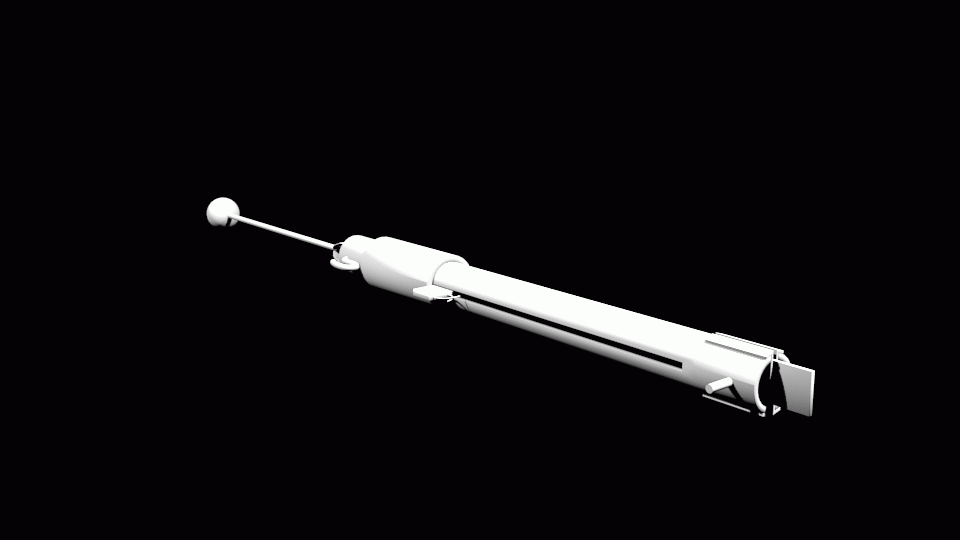The model can be downloaded [here](model.blend).

### Tools and Materials

*   Drill
*   Dremel
*   Hot glue gun plus hot glue
*   Masking tape, roughly 2 cm wide
*   Paperclips, medium sized
*   Wooden skewers, around 25 cm long and 3 mm in diameter
*   Lots and lots of rubber bands, around 6 cm flattened and unstretched
*   Heavy coathanger wire, roughly 3 mm diameter (stiff gardening wire works well too)
*   PVC pipe segment with approximately a 1/2 inch (1.27 cm) inner diameter, around 10 inches (25.4 cm) long and preferably schedule 80 (basically, about 3 mm thick)
*   PVC pipe segment with approximately a 7/8 inch (2.2225 cm) inner diameter, around 6 cm long - should fit over the 1/2 inner diameter pipe segment closely but loose enough to slide
*   Thin (around 1.5 mm) sheet metal, around 10 cm by 4 cm (an old, broken metal ruler works great for this)
*   Thin (around 1.5 mm) sheet plastic, around 10 cm by 5 cm

### Building the Body

The body holds everything in place and provides the necessary structural strength to maintain tension on the rubber bands.

Start with a PVC pipe segment:

Using the dremel, cut a slot roughly 16 cm long lengthwise through the sides of the pipe. This should be roughly 3mm wide:

Drill a hole near the end of the pipe that is farther from the slot, around 1 cm from the end. Thread the heavy wire through the hole and bend it into the shape shown below:

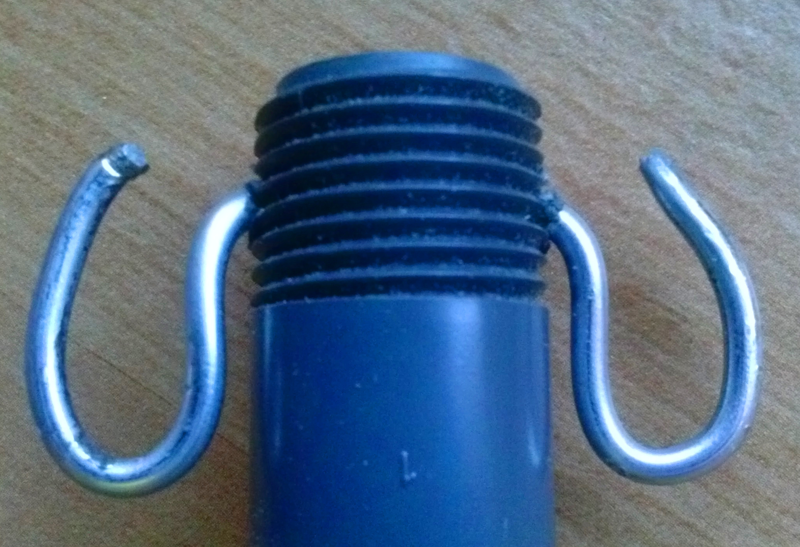

This is the rubber band holder. The purpose of this structure should be relatively self-explanatory.

Make sure to curve it on the inside so that the projectile has room to pass through later:

Slide the 7/8 inch inner diameter PVC pipe segment over the smaller pipe segment, leaving it slid up against the holder for now.

### Building the Firing Plate

The firing plate holds the projectile in place and is the part that actually moves forward while firing.

Start with a piece of sheet metal around 1.5 cm by 4.5 cm, and drill three colinear holes spaced about 1.5 cm apart:

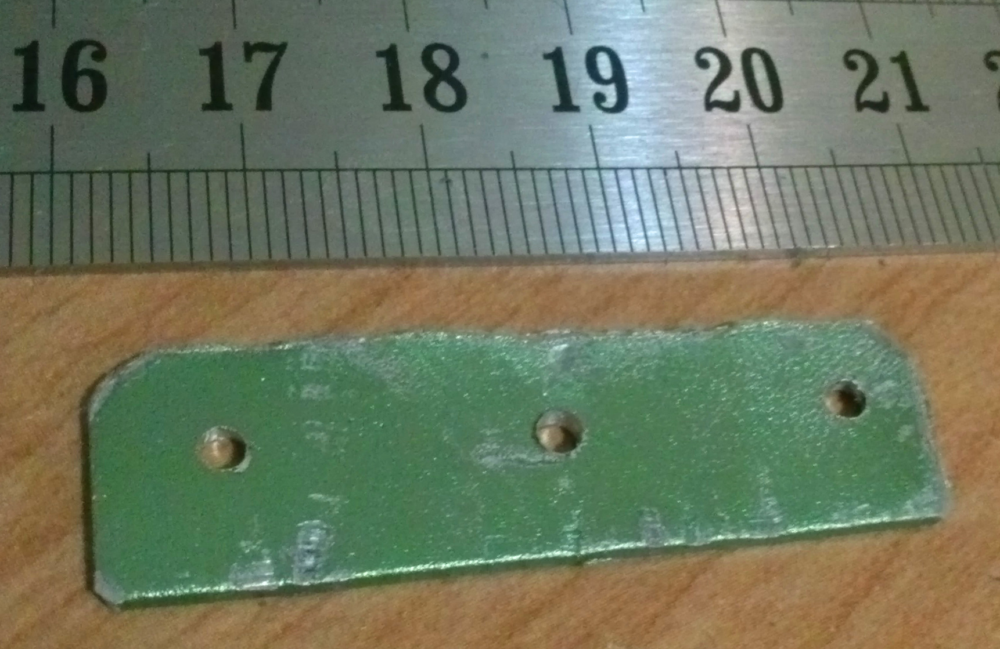

Wrap a paperclip around the center to form the catch, as shown below:

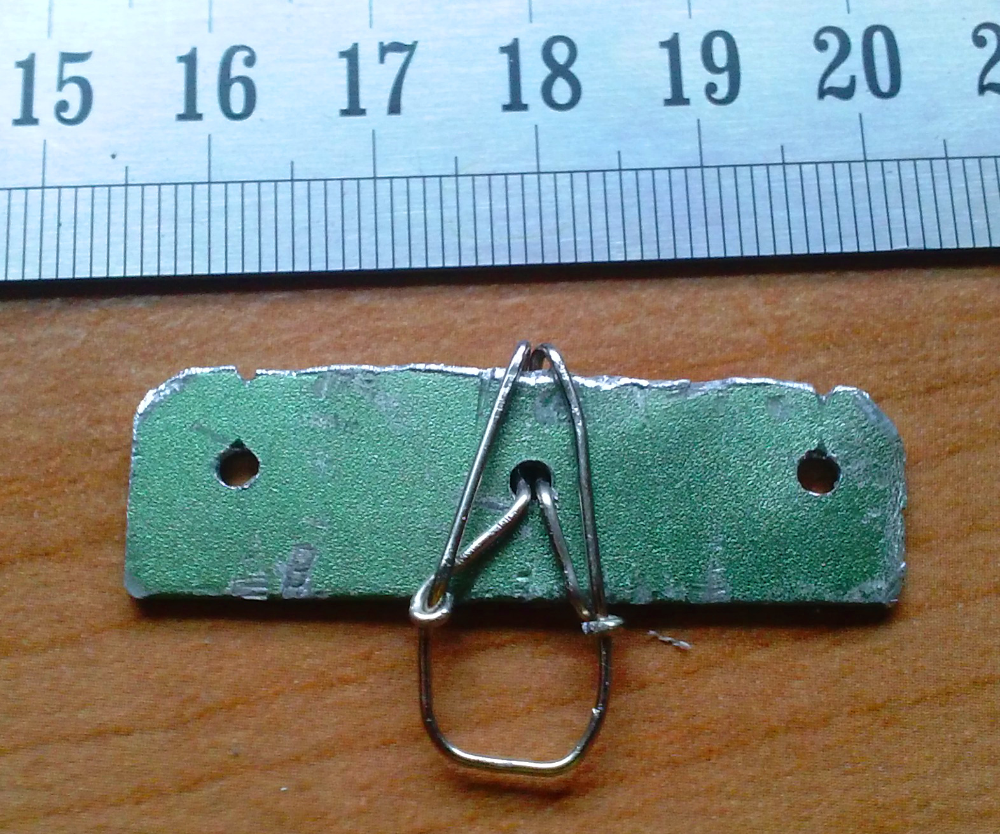

The catch is the loop of wire that sticks out of the plate, and is designed to get caught on the trigger. Also note the notches cut into the top side - they will be used after the firing plate is put in place.

Insert the firing plate into the slot, with the catch facing away from the holder wire we added earlier. It might be a bit of a squeeze, but with a bit of persistence it'll go in. Make sure the 7/8 inch pipe segment is between the holder and the firing plate.

We now bend paperclips around the outside parts as follows:

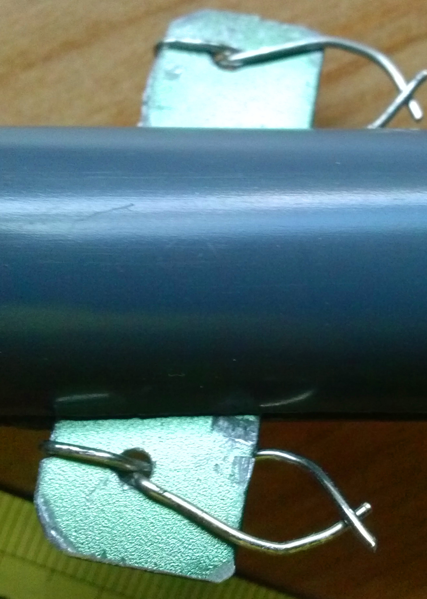

These structures are the other rubber band holders that keep them from slipping off of the firing plate.

Edited October 9, 2014: new plate design! This one has more holes, of smaller diameter, and the paperclips are bent in such a way as to leave the part where the projectile fits empty, which means it's easier to load the projectile:

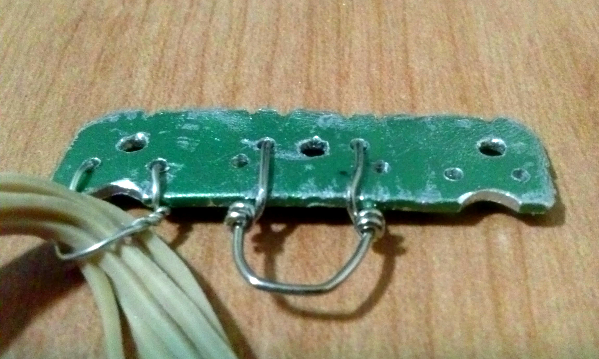

### Building the Trigger

Create the following shapes using the sheet metal and heavy wire:

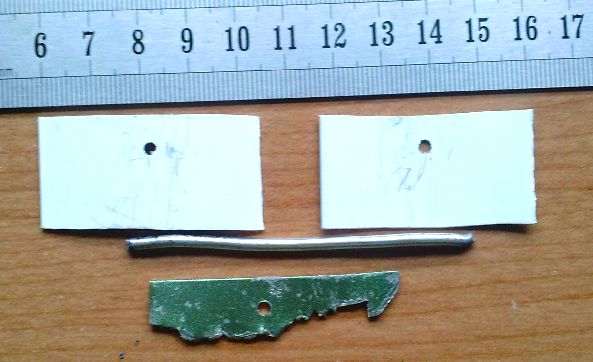

These parts make up the trigger mechanism. The top two pieces are the trigger guides that hold the hooked shape in the right place. The hooked shape at the bottom actually latches onto the firing plate catch. Finally, the length of stiff wire in the middle connects everything together and to the body. Note that there is a hole in three parts - these will align when assembling the mechanism.

In the picture, the top two pieces are plastic, since it is a little easier to work with. Sheet metal functions just as well, however.

Drill a hole in the end of the pipe closer to the slot, again roughly 1 cm from the end. Using the dremel, cut a 2.5 cm slot on one side of the pipe, and a 4 cm slot of the opposite side, both perpendicular to the 16 cm slot. These slots should be slightly wider - roughy 4 mm should work fine.

Fit the various pieces of the trigger into the two new slots, and thread the stiff wire through the holes in each part, which should align. Afterwards, bend the ends of the trigger guides outward to prevent them from rotating about the wire:

This might be somewhat difficult to assemble, and may help to tape some parts in place beforehand. At this point the trigger should be able to rotate freely, while the guides and wire are fixed in place:

### Building a Projectile

The projectile has three parts - the head, which is weighted and carries kinetic energy; the shaft, which transfers kinetic energy when firing and holds everything together; and the tail, which attaches the shaft to the firing plate.

The shaft is simply a single wooden skewer. On one end, we add a dollop of hot glue to blunt the tip for safety, and add a little weight to help it fly better:

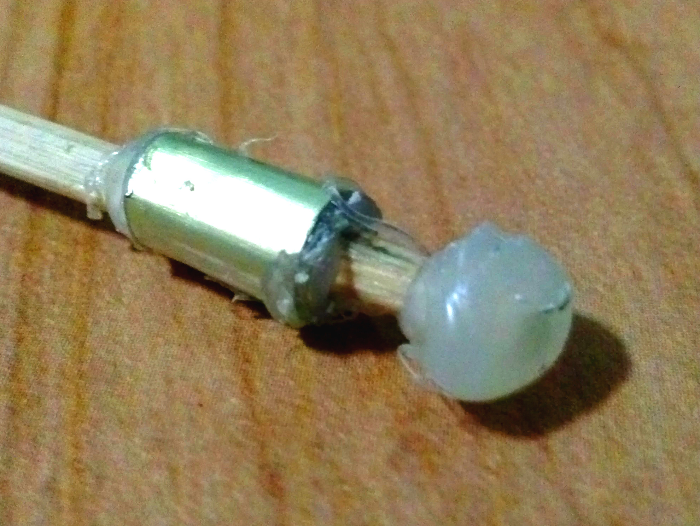

This is the head. The weight used in the picture above is some thinner (0.5 mm ) sheet metal, but just about anything heavy enough will work, like paperclips or washers.

The tail is made by wrapping masking tape about 2 cm from the end and then splitting the skewer in half lengthwise:

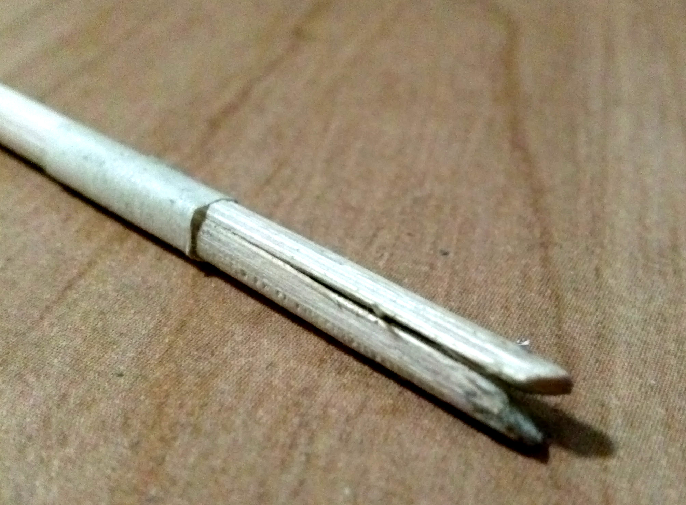

Note that the edges of the split are filed into a slope - this makes it easier to put into place when loading.

### Final Touches

A projectile rest holds the front of the projectile in position for better accuracy. It's simple to make one out of the thin sheet plastic:

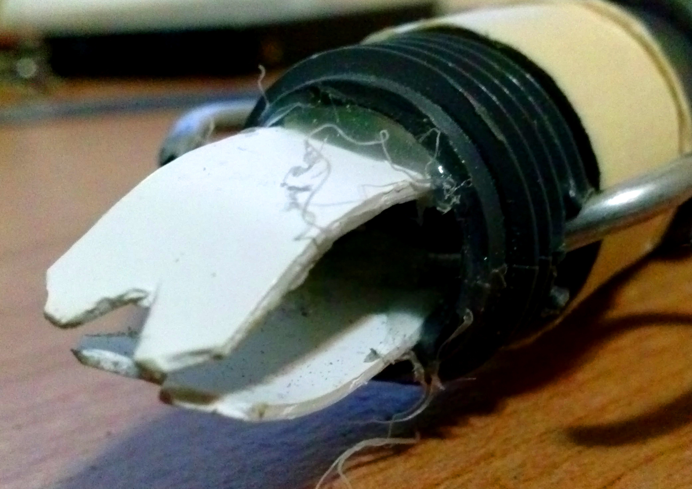

A wrap or two of tape around the holder end helps adsorb impact shock and makes the larger pipe segment stay in place when slid up to the top:

Of course, it won't work without any rubber bands, so make sure to put those in:

Done! All that's left is a bit of tweaking, and it's ready to run.
